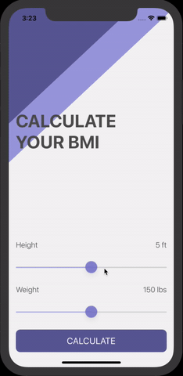

# BMI Calculator
A Body Mass Index Calculator built in Swift for iOS. Based on the user’s weight and height, it will calculate their body mass and give a piece of health advice

This app is inspired by the projects on The App Brewery's Complete App Development Bootcamp. Check out the full course at www.appbrewery.co
